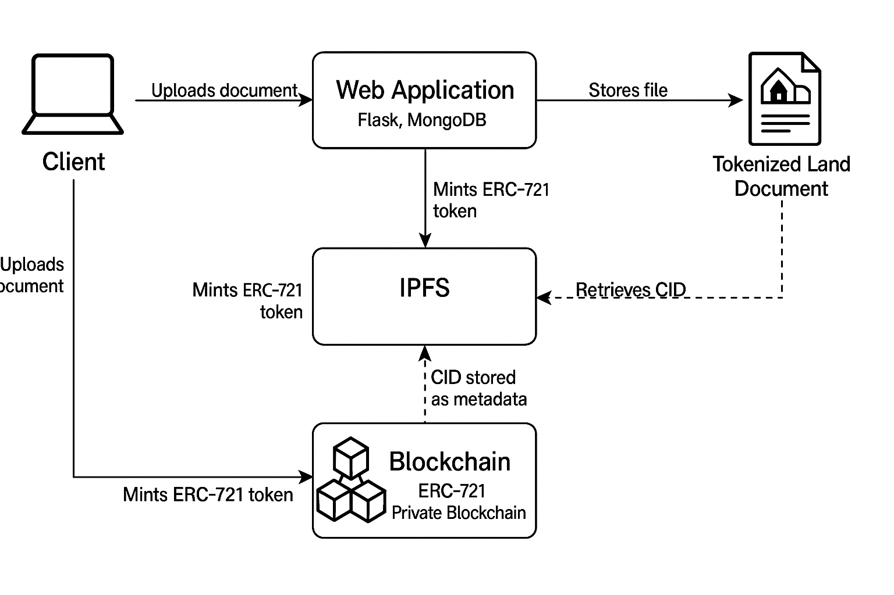

# Novis: Decentralized Digital Asset Tokenization & IPFS Storage Platform

[](https://geth.ethereum.org/)
[](https://soliditylang.org/)
[](https://openzeppelin.com/)
[](https://ipfs.tech/)
[](https://www.python.org/)
[](https://flask.palletsprojects.com/)
[](https://www.mongodb.com/)

A modern, production-grade Web3 application for securely storing digital documents (PDFs, images) on **IPFS**, generating cryptographic Content Identifiers (CIDs), tokenizing assets into authentic **ERC-721 Non-Fungible Tokens (NFTs)** on a private **Geth (Go-Ethereum) blockchain**, and delivering them automatically to users' **MetaMask** wallets.

---

## 🏗 System Architecture



### End-to-End Pipeline
1. **Document Upload**: User selects a PDF or PNG image via the responsive Web UI.
2. **IPFS Pinning**: The file is streamed to the local Kubo IPFS node (`http://127.0.0.1:5001`), returning an immutable multihash CID (`Qm...`).
3. **Smart Contract Tokenization**: The backend invokes the OpenZeppelin ERC-721 contract (`CIDToken.sol`) on the local Geth chain via EIP-1559 dynamic fee transactions.
4. **Direct Wallet Delivery**: The NFT is minted directly to the user's connected MetaMask address with `tokenURI` linked to `ipfs://<CID>`.
5. **Metadata Indexing**: Document metadata, user ownership, IPFS CID, and blockchain transaction receipts are recorded in MongoDB.
6. **MetaMask Asset Watching**: The UI prompts MetaMask via `wallet_watchAsset`, allowing users to track and view their newly minted token in real-time.

---

## 📁 Repository Structure

```text
final-year-project/
├── assets/
│   └── architecture_diagram.png     # High-resolution architectural diagram
├── backend/
│   ├── static/                      # Frontend CSS, JS, favicons, illustrations
│   ├── templates/
│   │   └── index.html               # Main Web UI with MetaMask wallet connector
│   ├── .env.example                 # Environment configuration template
│   ├── app.py                       # Flask REST API, Web3 controller, IPFS client
│   └── insert.py                    # MongoDB data access and schema utilities
├── blockchain/
│   ├── contracts/
│   │   ├── CIDToken.sol             # OpenZeppelin ERC-721 NFT Smart Contract
│   │   └── CIDToken.json            # Precompiled ABI & Bytecode artifact
│   ├── data/
│   │   ├── keystore/                # Encrypted private key for pre-funded account
│   │   └── password.txt             # Keystore unlock passphrase
│   ├── openzeppelin/                # OpenZeppelin v4.9.3 contracts library
│   ├── genesis.json                 # Custom PoS devnet genesis (Chain ID 12345)
│   ├── geth.exe                     # Go-Ethereum v1.17.6-stable 64-bit binary
│   ├── start_chain.bat              # 1-Click launcher for local Geth node
│   └── stop_chain.bat               # Safe shutdown script for Geth
├── IPFS/
│   ├── ipfs.exe                     # Kubo IPFS v0.34.1 binary
│   ├── start_ipfs.bat               # 1-Click launcher for IPFS daemon
│   └── stop_ipfs.bat                # Safe shutdown script for IPFS
├── .gitattributes                   # Git LFS tracking rules
├── .gitignore                      # Ignore runtime databases, logs, and .env
├── README.md                        # Project documentation
└── requirements.txt                 # Pinned Python package dependencies
```

---

## ⚡ Prerequisites

1. **Operating System**: Windows 10/11 64-bit (or Linux/macOS with respective Geth and IPFS binaries).
2. **Python**: Python 3.10, 3.11, or 3.12 installed and added to `PATH`.
3. **MongoDB**: Local MongoDB Community Server running on `127.0.0.1:27017` (automatic fallback enabled if not installed).
4. **MetaMask**: MetaMask browser extension installed in Chrome, Brave, Edge, or Firefox.

---

## 🚀 Quick Start Guide

Open **3 separate terminal windows** (CMD or PowerShell):

### Terminal 1: Launch Geth Blockchain
```cmd
cd blockchain
.\start_chain.bat
```
* Initializes `data/` on the first run using `genesis.json`.
* Starts Geth v1.17.6 with RPC listening on `http://127.0.0.1:8545` (Chain ID `12345`).
* Automatically seals blocks on-demand whenever a transaction is submitted.

---

### Terminal 2: Launch IPFS Daemon
```cmd
cd IPFS
.\start_ipfs.bat
```
* Starts Kubo IPFS daemon with API on `http://127.0.0.1:5001` and Gateway on `http://127.0.0.1:8080`.

---

### Terminal 3: Launch Flask Web Application
```cmd
# 1. Install dependencies (first time only)
pip install -r requirements.txt

# 2. Run backend
cd backend
python app.py
```
* Access the web application at **`http://127.0.0.1:5000`**.

---

## 🦊 MetaMask Network Configuration

When you click **"Connect Wallet"** in the Web UI, MetaMask will automatically prompt to add and switch to the local network. You can also add it manually:

| Setting | Value |
| :--- | :--- |
| **Network Name** | `Novis Local Devnet` |
| **New RPC URL** | `http://127.0.0.1:8545` |
| **Chain ID** | `12345` |
| **Currency Symbol** | `ETH` |

### Pre-Funded Test Account
* **Address**: `0xfa2Bb1C309d2a187aFA1FF535031C4Cc5406B7cf`
* **Private Key / Keystore**: Available in `blockchain/data/keystore/` (Password: `123`)
* **Allocated Balance**: `1,000 ETH`

---

## 📜 Smart Contract Specification

The project uses OpenZeppelin's standard ERC-721 implementation (`blockchain/contracts/CIDToken.sol`):

```solidity
// SPDX-License-Identifier: MIT
pragma solidity ^0.8.20;

import "../openzeppelin/contracts/token/ERC721/extensions/ERC721URIStorage.sol";
import "../openzeppelin/contracts/access/Ownable.sol";

contract CIDToken is ERC721URIStorage, Ownable {
    uint256 private _tokenIds;

    constructor() ERC721("NovisCIDToken", "NCID") Ownable() {}

    function mintToken(address recipient, string memory metadataCID) public returns (uint256) {
        _tokenIds++;
        uint256 newItemId = _tokenIds;
        _mint(recipient, newItemId);
        _setTokenURI(newItemId, string(abi.encodePacked("ipfs://", metadataCID)));
        return newItemId;
    }
}
```

* **Instant Compilation**: Precompiled ABI and bytecode are loaded directly from `CIDToken.json`, avoiding solc compilation bottlenecks during runtime.
* **EIP-1559 Support**: Dynamic fee calculation ensures transactions are processed reliably on modern Geth post-merge forks.

---

## 🔒 Security & Data Persistence

* **100% Local Disk Persistence**: All mined blocks, contracts, and state tries are stored locally on disk in `blockchain/data/geth/chaindata` using Pebble/LevelDB. Stopping and restarting Geth resumes from the exact previous block height.
* **Separation of Secrets**: Keystores and private keys are decoupled from web requests; client MetaMask transactions are signed client-side.
* **Decentralized Verification**: Files cannot be altered once pinned to IPFS; any modification produces a completely different cryptographic CID hash.

---

## 👨‍💻 Author & Repository

* **Repository**: [https://github.com/NoChance333/final-year-project](https://github.com/NoChance333/final-year-project)
* **Author**: NoChance333
* **Project**: BCA Final Year Project
